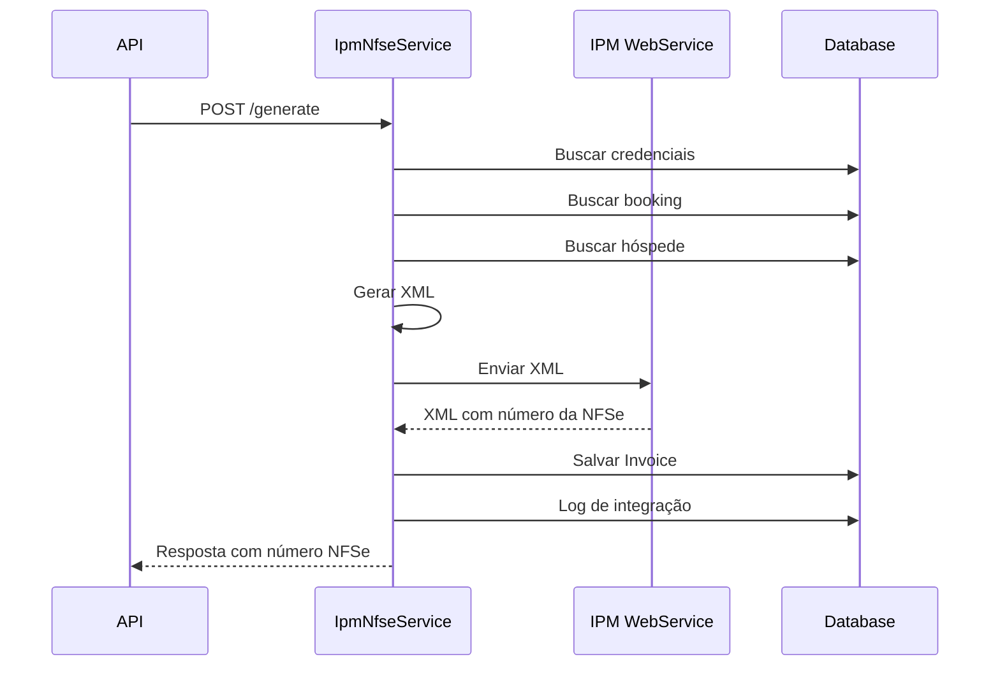

# Módulo de Nota Fiscal Eletrônica (NF-e) - IPM Sistemas

## 📋 Visão Geral

Este módulo integra o AvenSuites com o sistema **IPM Sistemas** para emissão, cancelamento e consulta de Notas Fiscais de Serviços Eletrônicas (NFS-e).

---

## 🏗️ Arquitetura

### **Entidades Criadas**

#### **1. IpmCredentials**
Armazena credenciais de acesso ao webservice IPM por hotel.

```csharp
- Id (Guid PK)
- HotelId (Guid FK → hotels)
- Username (string) - Usuário do sistema
- Password (string) - Senha criptografada
- CpfCnpj (string) - CPF/CNPJ do prestador
- CityCode (string) - Código TOM da cidade
- SerieNfse (string) - Série da NFSe (default: "1")
- Active (bool) - Ativo/Inativo
```

### **2. Invoice** (já existente)
Armazena as notas fiscais emitidas.

### **3. ErpIntegrationLog** (já existente)
Registra todas as chamadas ao webservice IPM.

---

## 🔧 Componentes

### **Services**

#### **IIpmNfseService** → **IpmNfseService**
Serviço principal de integração com IPM.

**Métodos:**
- `GenerateInvoiceAsync()` - Emite NF-e
- `CancelInvoiceAsync()` - Cancela NF-e
- `GetInvoiceByVerificationCodeAsync()` - Consulta por código de autenticidade
- `GetInvoiceByNumberAsync()` - Consulta por número/série

### **Repositories**

#### **IIpmCredentialsRepository** → **IpmCredentialsRepository**
Gerencia credenciais IPM.

#### **IErpIntegrationLogRepository** → **ErpIntegrationLogRepository**
Gerencia logs de integração.

---

## 📡 Endpoints Criados

### **1. Emitir NF-e**
```http
POST /api/invoices/{hotelId}/nfse/generate
```

**Request Body:**
```json
{
  "bookingId": "guid",
  "serieNfse": "1",
  "fatoGeradorDate": "2025-01-20",
  "totalValue": 750.00,
  "observations": "Reservas",
  "tomadorGuestId": "guid",
  "items": [
    {
      "codigoLocalPrestacao": "8319",
      "unidadeQuantidade": 1,
      "unidadeValorUnitario": 750.00,
      "codigoItemListaServico": "901",
      "descritivo": "Diárias",
      "aliquotaItemLista": 2.0100,
      "valorTributavel": 750.00
    }
  ]
}
```

### **2. Cancelar NF-e**
```http
POST /api/invoices/{hotelId}/nfse/cancel
```

**Request Body:**
```json
{
  "invoiceId": "guid",
  "nfseNumber": "123",
  "serieNfse": "1",
  "observation": "Cancelamento de teste"
}
```

### **3. Consultar por Código de Autenticidade**
```http
GET /api/invoices/{hotelId}/nfse/verification/{codigo}
```

### **4. Consultar por Número**
```http
GET /api/invoices/{hotelId}/nfse/{numero}/serie/{serie}
```

---

## 🔐 Como Configurar Credenciais IPM

### **1. Via API (Futuro)**
```http
POST /api/ipm-credentials
{
  "hotelId": "guid",
  "username": "usuario_ipm",
  "password": "senha_segura",
  "cpfCnpj": "12.345.678/0001-90",
  "cityCode": "8319",
  "serieNfse": "1"
}
```

### **2. Via SQL (Manual)**
```sql
INSERT INTO ipm_credentials (
  id, hotel_id, username, password, 
  cpf_cnpj, city_code, serie_nfse, active
) VALUES (
  UUID(), 
  'guid-do-hotel',
  'usuario_ipm',
  'senha_criptografada',
  '12.345.678/0001-90',
  '8319',
  '1',
  1
);
```

---

## 📝 Formato dos XMLs

### **XML de Criação de NF-e**

```xml
<nfse id="nota">
  <identificador>NOTA-20250618-001</identificador>
  
  <!-- Dados da NFS-e -->
  <nf>
    <serie_nfse>1</serie_nfse>
    <data_fato_gerador>18/06/2025</data_fato_gerador>
    <valor_total>750,00</valor_total>
    <valor_desconto>0,00</valor_desconto>
    <observacao>Reservas</observacao>
  </nf>
  
  <!-- Prestador (Hotel) -->
  <prestador>
    <cpfcnpj>12.345.678/0001-90</cpfcnpj>
    <cidade>8319</cidade>
  </prestador>
  
  <!-- Tomador (Hóspede) -->
  <tomador>
    <tipo>F</tipo>
    <cpfcnpj>01234567890</cpfcnpj>
    <nome_razao_social>João da Silva</nome_razao_social>
    <logradouro>Rua das Flores</logradouro>
    <numero_residencia>123</numero_residencia>
    <bairro>Centro</bairro>
    <cidade>8319</cidade>
    <cep>89240000</cep>
  </tomador>
  
  <!-- Itens -->
  <itens>
    <lista>
      <tributa_municipio_prestador>N</tributa_municipio_prestador>
      <codigo_local_prestacao_servico>8319</codigo_local_prestacao_servico>
      <unidade_codigo>1</unidade_codigo>
      <unidade_quantidade>1</unidade_quantidade>
      <unidade_valor_unitario>750,00</unidade_valor_unitario>
      <codigo_item_lista_servico>901</codigo_item_lista_servico>
      <descritivo>Diárias</descritivo>
      <aliquota_item_lista_servico>2,0100</aliquota_item_lista_servico>
      <situacao_tributaria>0</situacao_tributaria>
      <valor_tributavel>750,00</valor_tributavel>
    </lista>
  </itens>
</nfse>
```

### **XML de Cancelamento**

```xml
<nfse id="nota">
  <nf>
    <numero>123</numero>
    <serie_nfse>1</serie_nfse>
    <situacao>C</situacao>
    <observacao>Cancelamento de teste</observacao>
  </nf>
  
  <prestador>
    <cpfcnpj>12345678000195</cpfcnpj>
    <cidade>4215807</cidade>
  </prestador>
</nfse>
```

---

## 📊 Códigos e Tributos

### **Código de Item de Lista de Serviços**
- **901**: Serviços de hospedagem (diárias)
- **1705**: Outros tipos de hospedagem

### **Alíquotas Comuns**
- **2,0100%**: Alíquota padrão para hospedagem
- **0,03%**: Alíquota alternativa

### **Códigos TOM (Cidades)**
- **8319**: São Francisco do Sul/SC
- **4215807**: Outro município

---

## 🔄 Fluxo de Emissão de NF-e



---

## ⚠️ Implementações Pendentes

### **1. Chamada ao Webservice IPM**

```csharp
private async Task<IpmNfseResponse> CallIpmWebService(string xmlContent)
{
    // Implementar chamada SOAP/REST
    using var client = new HttpClient();
    var request = new StringContent(xmlContent, Encoding.UTF8, "application/xml");
    var response = await client.PostAsync("https://webservice-ipm.com.br/nfse", request);
    var responseContent = await response.Content.ReadAsStringAsync();
    
    // Parse XML da resposta
    // Retornar dados da NFSe
}
```

### **2. Armazenamento de XMLs e PDFs**

Os XMLs e PDFs retornados devem ser armazenados no S3:
- `XmlS3Key` - Chave do XML no S3
- `PdfS3Key` - Chave do PDF no S3

### **3. Webhook para Processamento Assíncrono**

Implementar webhook do IPM para receber confirmações:
- NF-e emitida com sucesso
- NF-e rejeitada
- NF-e cancelada

---

## 🧪 Como Testar

### **1. Configurar Credenciais (SQL)**
```sql
INSERT INTO ipm_credentials VALUES (
  UUID(),
  'guid-hotel-avenida',
  'usuario_ipm',
  'senha_ipm',
  '12.345.678/0001-90',
  '8319',
  '1',
  1,
  NOW(),
  NOW()
);
```

### **2. Emitir NF-e de Teste**
```bash
curl -X POST http://localhost:5000/api/invoices/{hotelId}/nfse/generate \
  -H "Content-Type: application/json" \
  -d '{
    "bookingId": "guid",
    "fatoGeradorDate": "2025-01-20",
    "totalValue": 750.00,
    "tomadorGuestId": "guid",
    "items": [...]
  }'
```

---

## 📚 Próximos Passos

1. **Implementar chamada real ao webservice IPM**
2. **Adicionar tratamento de erros robusto**
3. **Implementar retry com Polly**
4. **Criar testes unitários e de integração**
5. **Dashboard para visualizar NF-es emitidas**

---

**Módulo criado com sucesso! 🎉**

